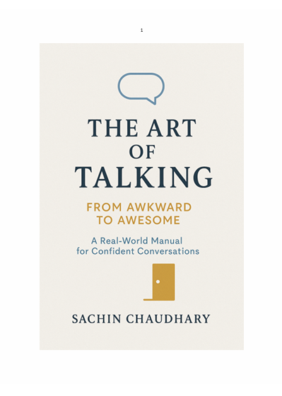

# -The-Art-of-Talking-From-Awkward-to-Awesomeness-
A *professional lab manual* created by [Sachin Chaudhary](https://github.com/sachindecodes) that transforms communication skills step by step.   This project blends *personal experience, structured practice, and AI collaboration (ChatGPT)* into a complete guide to confident and engaging conversations.  

## 📘 Contents of the Manual  
- *Foundations of Great Conversations* – eye contact, presence, voice control  
- *Smart Starters & “Me-Too” Moments* – openers that create instant connection  
- *The 3C Framework* – Content, Connection, Confidence  
- *Icebreaker Topics with a Twist* – facts flipped into humor  
- *Daily Drills* – structured exercises for fluency and quick thinking  
- *Talk Bank Templates* – ready-to-use openers, compliments, and one-liners  
- *Humor Hacks & Roasts* – practical and respectful use of wit  
- *Real-Life Confidence Fixes* – how to handle silence, blank-outs, or group settings  
- *Conversation as a Life Skill* – communication in careers, relationships, and self-growth  

---

## 📂 Files in This Repository  
- The_Art_of_Talking_Manual_With_Cover.pdf → Complete manual (with cover)  
-   

---

## 📖 How to Use This Manual  
1. *Daily Practice* → Use the short drills (1–5 mins) for fluency and quick thinking.  
2. *Build a Talk Bank* → Collect 1 new idea, fact, or memory each day.  
3. *Apply in Real Life* → Test techniques in actual conversations (friends, interviews, networking).  
4. *Weekly Review* → Reflect on one conversation each week and refine using the tools.  

This structured approach helps turn the manual into a *practical training program*.  

---

## 👤 Author  
*Sachin Chaudhary*   
- [🎥 YouTube](https://youtube.com/@SachinDecodes)  
- [💻 GitHub](https://github.com/sachindecodes)  
- [💼 LinkedIn](https://www.linkedin.com/in/sachindecodes)  
- [🌐 Portfolio](https://sachin-chaudhary-l2vbqho.gamma.site/)
---

## 📜 License  
This work is licensed under the *Creative Commons Attribution-NonCommercial-ShareAlike 4.0 International License (CC BY-NC-SA 4.0)*.  

You may:  
- ✅ Share — copy and redistribute for personal or educational use  
- ✅ Adapt — remix, transform, build upon the material  
- ❌ Not use it for commercial purposes  
- ✅ Give credit and share under the same license  

---

## 🌟 Why This Manual?  
This manual represents a *journey from silence to self-expression*. It is designed for learners, professionals, and anyone who wishes to build confidence, clarity, and charm in their conversations.  

> “Communication is not about perfect words. It’s about presence, curiosity, and connection.”
